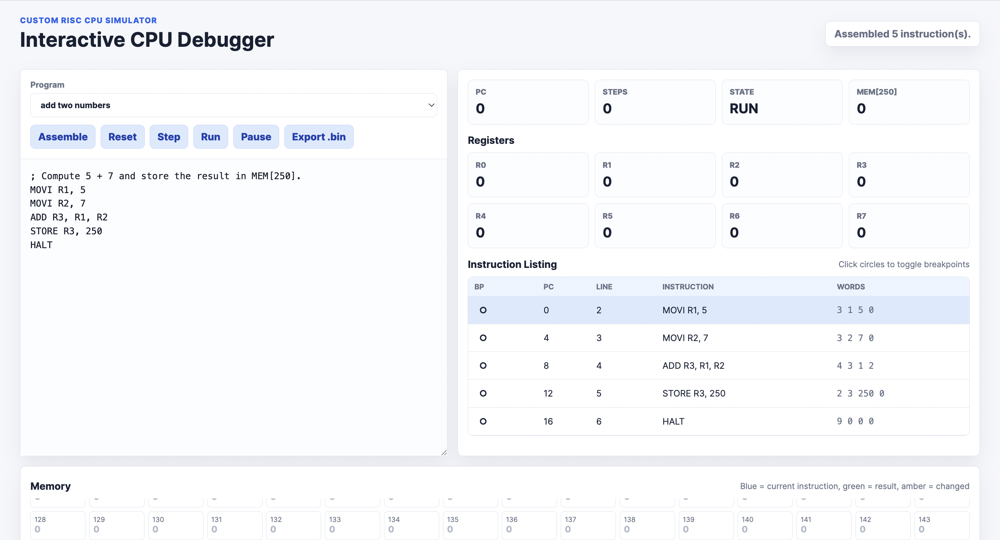

# Custom RISC CPU Simulator

A complete portfolio project that demonstrates a small custom RISC-like CPU from assembly source code all the way down to simulation and hardware description.

This repository includes:

- A C-based CPU simulator with fetch-decode-execute behavior.
- A lightweight two-pass assembler for `.asm` source files.
- A disassembler for inspecting integer `.bin` machine-code files.
- Example assembly programs for arithmetic, loops, and Fibonacci logic.
- A matching Verilog implementation of the same instruction set.
- An Icarus Verilog testbench that generates a GTKWave-compatible VCD file.
- Automated C and Verilog regression tests for core programs and invalid-input handling.
- An interactive browser debugger for assembling, stepping, tracing, and visualizing CPU state.
- An expanded ISA with bitwise operations, shifts, register-indirect memory, signed branches, stack operations, subroutine calls, flags, and memory-mapped output.

The main project lives in [`custom-risc-cpu/`](custom-risc-cpu/).

## Why This Project Matters

This project is designed to show practical systems knowledge in a compact, reviewable codebase. It connects several important low-level computing concepts:

- Instruction set architecture design.
- Register files and memory.
- Program counters and branch control.
- Assembly parsing and label resolution.
- CPU simulation in C.
- Hardware modeling in Verilog.

It is intentionally small enough to understand quickly, but complete enough to discuss in an interview or include in a resume portfolio.

## Architecture

The custom CPU uses:

- 8 general-purpose registers: `R0` through `R7`.
- 256 words of shared instruction/data memory.
- A program counter (`PC`).
- Fixed-width 4-integer instructions:

```text
[opcode] [a] [b] [c]
```

Each assembly instruction is assembled into four integers. The simulator loads those integers into memory, fetches one instruction at a time, decodes the opcode, executes the operation, and updates the program counter.

## Instruction Set

| Instruction | Format | Purpose |
| --- | --- | --- |
| `NOP` | `NOP` | Do nothing |
| `LOAD` | `LOAD rd, addr` | Load memory into a register |
| `STORE` | `STORE rs, addr` | Store a register into memory |
| `MOVI` | `MOVI rd, imm` | Move an immediate value into a register |
| `ADD` | `ADD rd, rs1, rs2` | Add two registers |
| `SUB` | `SUB rd, rs1, rs2` | Subtract two registers |
| `JMP` | `JMP label` | Jump unconditionally |
| `BEQ` | `BEQ rs1, rs2, label` | Branch if equal |
| `BNE` | `BNE rs1, rs2, label` | Branch if not equal |
| `HALT` | `HALT` | Stop execution |
| `ADDI` | `ADDI rd, rs, imm` | Add immediate |
| `AND` | `AND rd, rs1, rs2` | Bitwise AND |
| `OR` | `OR rd, rs1, rs2` | Bitwise OR |
| `XOR` | `XOR rd, rs1, rs2` | Bitwise XOR |
| `SHL` | `SHL rd, rs, imm` | Shift left |
| `SHR` | `SHR rd, rs, imm` | Logical shift right |
| `LOADR` | `LOADR rd, addrReg` | Load using a register-held address |
| `STORER` | `STORER rs, addrReg` | Store using a register-held address |
| `JLT` | `JLT rs1, rs2, label` | Signed branch if less than |
| `JGT` | `JGT rs1, rs2, label` | Signed branch if greater than |
| `PUSH` | `PUSH rs` | Push register onto stack |
| `POP` | `POP rd` | Pop stack into register |
| `CALL` | `CALL label` | Push return address and jump |
| `RET` | `RET` | Return from subroutine |

`R7` is the stack pointer by convention. It starts at `256`, and stack operations pre-decrement before writing. `MEM[255]` is memory-mapped output for simple demo programs.

## Quick Start

Open the browser debugger:

```sh
cd custom-risc-cpu/web-debugger
python3 -m http.server 8000
```

Then visit `http://localhost:8000`.



Build and run the C simulator:

```sh
cd custom-risc-cpu/c-simulator
make
make run PROG=programs/add_two_numbers
```

Run the full regression suite:

```sh
cd custom-risc-cpu
make test
```

Run another example manually:

```sh
cd custom-risc-cpu/c-simulator
./assembler programs/sum_1_to_10.asm programs/sum_1_to_10.bin
./cpu_sim programs/sum_1_to_10.bin --trace
./disassembler programs/sum_1_to_10.bin
```

Expected example results:

| Program | Output |
| --- | --- |
| `add_two_numbers.asm` | `MEM[250] = 12` |
| `sum_1_to_10.asm` | `MEM[250] = 55` |
| `fibonacci_10_terms.asm` | `MEM[250] = 88` |
| `isa_v2_demo.asm` | `MEM[250] = 20` |

## Verilog Simulation

Run the hardware simulation with Icarus Verilog:

```sh
cd custom-risc-cpu/verilog
iverilog -o cpu_tb testbench.v cpu.v alu.v register_file.v memory.v control.v
vvp cpu_tb
gtkwave dump.vcd
```

The testbench loads `programs/add_two_numbers.mem`, executes the CPU, prints trace information, and writes `dump.vcd` for waveform inspection.

Run the Verilog regression tests:

```sh
./tests.sh
```

## Debugging Features

The project includes both CLI and visual debugging:

- Optional tracing with `--trace`.
- Register validation.
- Memory bounds checking.
- Branch target validation.
- Execution limit protection for infinite loops.
- Final register and non-zero memory dumps.
- Strict machine-code token parsing.
- Verilog simulation fault detection for invalid operands, addresses, and PC values.
- Browser-based stepping, breakpoints, register/memory highlighting, trace logging, and `.bin` export.
- Flags for zero, negative, and carry/overflow-style arithmetic status.
- `MEM[255]` memory-mapped output for simple I/O-style demos.

These features make it easier to debug PC updates, branch logic, loop behavior, and memory/register state.

## Resume Bullets

- Built a custom RISC-style CPU simulator in C with fetch-decode-execute control flow, branch handling, tracing, memory bounds checking, and register validation.
- Implemented a two-pass assembler that converts labeled assembly programs into integer-based machine code with clear diagnostics for malformed input.
- Designed and tested a matching Verilog CPU implementation with ALU, register file, control unit, memory module, fault detection, and waveform-generating Icarus Verilog testbench.
- Built an interactive browser debugger that assembles code, steps execution, manages breakpoints, highlights CPU state changes, and exports machine code.
- Expanded the ISA with stack/subroutine support, register-indirect memory, signed branches, bitwise operations, shifts, condition flags, and memory-mapped output.

## Full Documentation

See [`custom-risc-cpu/README.md`](custom-risc-cpu/README.md) for the complete architecture notes, file layout, build instructions, assembler details, simulator behavior, Verilog mapping, and sample output.
